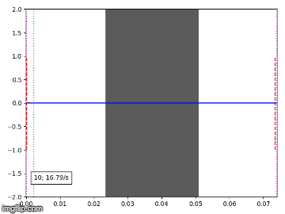
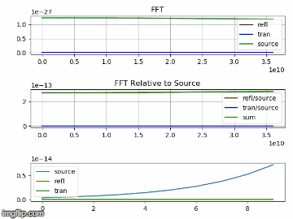

# Heaviside

Heaviside is a Python implementation of a FDTD (finite difference time domain) EM (electromagnetics) solver. Primary purpose of this code is to be a learning tool.

Please review the #TODO comments in the code.  Several things may only be partially implemented, or have known deficiencies.

## Prerequisites

Developed with Python 3.7, with the following modules installed:
```
PyYAML 3.13
cycler 0.10.0
kiwisolver 1.0.1
matplotlib 3.0.2
numpy 1.16.0
pip 18.1
pyparsing 2.3.1
python-dateutil	2.7.5
scipy 1.2.0
setuptools 40.6.3
six 1.12.0
```

## Running the program

If heaviside.py is run directly, a menu of examples will be presented.

```
------------------------------------- MENU -------------------------------------
0. EXIT
1. default1d.yaml
2. default2d.yaml
3. default3d.yaml
4. example_1d_quarterwavelength_transformer.yaml
5. example_1d_quarterwavelength_transformer_thru.yaml
--------------------------------------------------------------------------------
Enter your choice: 
```

## Examples




## License

This project is licensed under the MIT License - see the [LICENSE.md](LICENSE.md) file for details

## Acknowledgments

* Dr. Raymond C. Rumpf's lectures were incredibly helpful in understanding the material
  * http://emlab.utep.edu/
  * https://www.youtube.com/channel/UCPC6uCfBVSK71MnPPcp8AGA 
